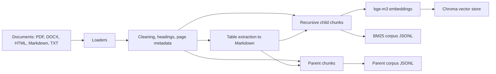
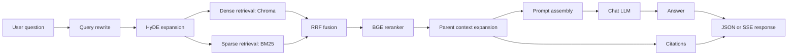

# RAG 知识问答系统架构

本文档描述当前仓库中已经落地的本地开发版架构。它不是生产压测报告；所有性能和质量结论都应来自可复现脚本、评估报告或人工记录。

## 架构定位

本项目是一个面向企业知识库问答场景的 RAG 系统样例，核心链路分为离线入库和在线问答两部分：

- 离线入库负责解析文档、清洗和分块、生成 embedding、写入 Chroma 向量库，并持久化 BM25 与父块语料。
- 在线问答负责查询改写、HyDE 扩展、dense + sparse 混合检索、RRF 融合、BGE reranker 精排、父块上下文展开、提示词组装、LLM 生成、流式输出和引用返回。

## 离线入库流程

入库入口是 `python -m scripts.ingest` 或 API 的 `POST /ingest`。默认文档目录为 `data/documents`，向量索引目录为 `data/chroma`。

当前支持的文档格式：

- PDF：使用 `pypdf` 按页抽取文本，清理可检测的重复页眉/页脚，并保留页码 metadata；如果安装 `pdfplumber`，会额外尝试抽取表格并转为 Markdown 表格块，metadata 标记 `content_type=table`。
- DOCX：使用 `python-docx` 抽取段落、标题和表格；标题会以 Markdown 标题保留在正文中，表格会转为独立 Markdown 表格块并记录 `table_index` 和当前标题层级。
- HTML/HTM：使用 BeautifulSoup 优先抽取 `main`/`article`/`body` 语义内容，去除 script/style/nav/header/footer/aside 噪声，保留标题和正文，并将表格转为 Markdown 表格块。
- Markdown/TXT：直接按 UTF-8 文本读取并做空白归一化。

分块器对 `content_type=table` 的文档采用表格感知策略：小表格尽量整表保留，超出 chunk 大小时按完整行切分并重复表头，减少把同一行拆到多个 chunk 的情况。扫描版 PDF/OCR 属于可选增强项；当前默认入库不会因为本机缺少 OCR 或 PDF 表格工具而失败。

## 在线问答流程

在线入口包括：

- `POST /ask`：返回完整 JSON 答案和引用。
- `POST /ask/stream`：通过 SSE 流式返回 token，结束时返回引用列表。
- 前端静态页面：支持健康检查、重建索引、运行评估、流式提问和引用查看。

## 组件表

| 组件 | 当前实现 | 作用 | 本地开发默认 | 生产变体 |
| --- | --- | --- | --- | --- |
| Loader | `app.ingestion.loaders` | 加载 PDF、DOCX、HTML、MD、TXT | 本地文件目录，文本清洗，标题和表格 metadata | 对接对象存储、权限系统、增量同步 |
| Table extraction | `app.ingestion.table_extractors` | 将 DOCX、HTML、可选 PDF 表格转为 Markdown | DOCX/HTML 默认启用；PDF 表格依赖可选 `pdfplumber` | 版面模型、专用 OCR、表格结构恢复 |
| Chunker | `app.ingestion.chunker` | 生成 child chunks 和 parent chunks | 递归文本分块 + 表格感知分块 | 结合标题层级、表格、OCR、版面结构 |
| Embeddings | `app.rag.embeddings` | 文本向量化 | 本地 `bge-m3` / `BAAI/bge-m3` | 托管 embedding API 或私有推理服务 |
| Vector store | `app.rag.vector_store` | 稠密向量索引与召回 | Chroma 本地目录 | Milvus、pgvector、Elastic vector 等 |
| Sparse retriever | `app.rag.bm25` | 关键词召回 | JSONL BM25 语料 | Elasticsearch/OpenSearch BM25 |
| Fusion | `app.rag.fusion` | 合并 dense 与 sparse 排名 | RRF | 可加入权重调参和按场景策略路由 |
| Reranker | `app.rag.reranker` | 对候选片段精排 | `BAAI/bge-reranker-v2-m3` | 独立 rerank 服务、批处理、缓存 |
| Parent store | `app.rag.parent_store` | 子块命中后展开父块上下文 | JSONL 父块语料 | 数据库或文档服务 |
| Query transform | `app.rag.query_transform` | Query rewrite 和 HyDE | 默认开启，最多 4 个变体 | 按用户、权限、成本和失败率动态开关 |
| LLM | `app.rag.llm` | 生成最终回答 | OpenAI-compatible chat API | 多模型路由、降级、审核和预算控制 |
| Cache | `app.rag.cache` | 可选缓存最终答案和引用 | 默认关闭；可用 Redis 或测试内存缓存 | Redis Cluster、按租户/权限/index version 设计 key |
| Middleware | `app.middleware` | 请求日志和基础耗时 | 结构化文本日志，响应头返回 request id 和耗时 | OpenTelemetry、JSON logs、集中化指标和告警 |
| Frontend | `app/web/static` | Demo 操作界面 | FastAPI 静态文件 | 独立前端、鉴权、审计和可观测性 |
| Evaluation | `app.evaluation`, `scripts.evaluate`, `scripts.evaluate_answers` | 检索质量与 RAGAS 答案质量评估 | JSONL 数据集，输出 JSON 报告 | 定期评测、报告入库、CI 门禁、趋势看板 |

## 本地开发版与生产版边界

当前仓库已经实现可演示的本地 RAG 闭环，但以下能力应被表述为生产化方向，而不是已验证的生产能力：

- Chroma 是默认本地向量库；Milvus 等服务可作为生产替代方案，但本仓库尚未提供已压测的 Milvus 部署结果。
- BM25 语料以 JSONL 持久化；生产环境通常应使用 Elasticsearch/OpenSearch 等可扩展检索服务。
- 父块语料保存在 JSONL；生产环境需要考虑并发读写、版本管理、权限过滤和回滚。
- Redis 已作为默认关闭的答案缓存抽象和 Compose profile 提供；Nginx、Kubernetes、队列和观测平台属于生产部署增强项。没有实际部署和压测前，不应宣称 QPS、P95 或可用性指标。
- 回答级质量评估以 RAGAS 为必需流水线，依赖评审 LLM 凭据和网络；没有真实报告前，不应声称具体答案质量分数。
- 部署和生产可用性边界见 `docs/deployment.md` 与 `docs/production-readiness.md`。

## 可复现性原则

- 默认 embedding 为本地 `bge-m3`，配置项为 `EMBEDDING_MODEL=bge-m3`。
- 所有检索指标应由 `python -m scripts.evaluate` 生成；所有答案级指标应由 `python -m scripts.evaluate_answers` 的 RAGAS 报告生成。
- README 和面试叙述中不应引用模板站点的示例百分比提升，除非仓库中存在对应数据集、命令和报告。
